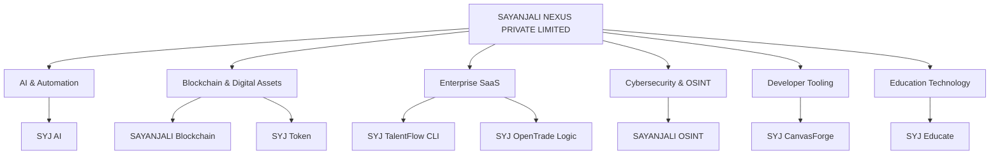
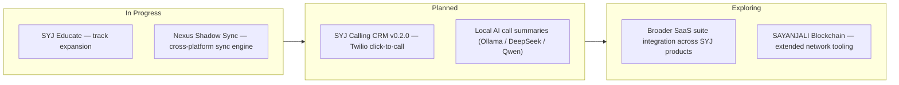

# SYED ALI HASAN MOOSAVI

### Founder & Managing Director · SAYANJALI NEXUS PRIVATE LIMITED

 

  
    <a href="#about">About</a> ·
    <a href="#what-i-build">What I Build</a> ·
    <a href="#ecosystem">Ecosystem</a> ·
    <a href="#featured-projects">Featured Projects</a> ·
    <a href="#project-explorer">Project Explorer</a> ·
    <a href="#stack">Stack</a> ·
    <a href="#analytics">Analytics</a> ·
    <a href="#roadmap">Roadmap</a> ·
    <a href="#contact">Contact</a>
  

---

<h2 id="about">About</h2>

I'm the Founder and Managing Director of **SAYANJALI NEXUS PRIVATE LIMITED**, a registered technology company headquartered in Hyderabad, India. I design and ship production-grade software across artificial intelligence, blockchain infrastructure, enterprise automation, cybersecurity, and developer tooling — from architecture through deployment.

Every system I build starts from the same constraint: it has to run cleanly on constrained, non-traditional environments before it earns a place in production. That discipline shapes how I write software — lean, dependency-conscious, and built to run anywhere, including entirely from Android via Termux.

**Mission** — Build software that removes friction from real operations: compliance, communication, security, and data — without vendor lock-in or unnecessary complexity.

**Vision** — A product ecosystem under SAYANJALI NEXUS where AI, blockchain, and automation infrastructure are open, auditable, and genuinely useful to the businesses that adopt them — not just demo-ready.

<h2 id="what-i-build">What I Build</h2>

**Core Domains**
- Artificial Intelligence & applied LLM systems
- Enterprise automation & workflow platforms
- Blockchain infrastructure & tokenomics
- Cybersecurity, OSINT & threat tooling
- Developer tools & CLI platforms
- Education technology

**Working Principles**
- Local-first AI (Ollama, DeepSeek, Qwen) over closed APIs
- Complete, production-ready deliverables — no partial snippets
- Mobile-first, resource-constrained engineering by default
- Verified through live end-to-end testing, not isolated demos
- Honest scope — no overstated claims, no vaporware

<h2 id="ecosystem">Company & Product Ecosystem</h2>

**SAYANJALI NEXUS PRIVATE LIMITED** — a registered Indian technology company operating across AI product development, blockchain infrastructure, cybersecurity/OSINT, enterprise SaaS, developer tooling, and education technology, under the SAYANJALI / SYJ brand ecosystem.

---

<h2 id="featured-projects">Featured Projects</h2>

### 🔗 SAYANJALI Blockchain

Enterprise blockchain ecosystem — proof-of-work consensus engine, ECDSA-based wallet cryptography, and full public documentation, verified with an automated test suite.

`Python` `ECDSA` `Proof-of-Work`

---

### 🧠 SYJ AI

Platform showcasing enterprise AI solutions, automation tooling, and applied intelligent applications across the SAYANJALI NEXUS product suite.

`Python` `FastAPI` `Applied AI`

---

### 🪙 SYJ Token

Digital asset ecosystem designed for real-world utility and enterprise integration, with public tokenomics and roadmap documentation.

`Tokenomics` `Blockchain` `Ecosystem Design`

---

### 📋 SYJ TalentFlow CLI

Terminal-based recruitment and hiring automation platform for structured, repeatable candidate workflows.

`CLI` `Automation` `HR Tech`

---

### 🎓 SYJ Educate

Open-source engineering education platform spanning eight learning tracks — AI, Backend, Database, Frontend, Security, OSINT, and Automation — with applied industry examples, verified through live end-to-end testing from fresh environments.

`Full-Stack` `Curriculum Engineering` `Open Source`

---

### 🎨 SYJ CanvasForge

Professional visual content generation platform with AI-powered creative workflows for brand and product content.

`AI` `Content Generation` `Automation`

---

### 📈 SYJ OpenTrade Logic

Enterprise-grade trade automation and financial workflow platform built for reliability over speed-to-demo.

`Python` `Financial Automation` `Enterprise`

---

### 🗂️ More Repositories

The full catalog spans AI, blockchain, security, and developer tooling — browse it category by category below.

---

<h2 id="project-explorer">Project Explorer</h2>

60+ public repositories, organized by domain. Each section links to a live, filtered view of the full catalog on GitHub.

<b>🤖 AI & Machine Learning</b>

 

- **SYJ AI** — enterprise AI platform and automation tooling
- **SYJ Mail Intelligence AI** — Gmail-integrated mail analysis and summarization, running on local LLM inference
- **ARIA** — Anthropic API-backed conversational assistant
- **Zara** — AI assistant deployable as a React component, embeddable widget, and Instagram DM bot

[Browse all AI repositories →](https://github.com/SHalimoosavi?tab=repositories&q=ai)

<b>⛓️ Blockchain & Web3</b>

 

- **SAYANJALI Blockchain** — proof-of-work chain with ECDSA wallet cryptography and an automated test suite
- **SYJ Token** — tokenomics design and ecosystem strategy

[Browse all blockchain repositories →](https://github.com/SHalimoosavi?tab=repositories&q=blockchain)

<b>🏥 Healthcare SaaS</b>

 

Document processing, compliance, and operational automation built for healthcare and hospital-facing engagements under SAYANJALI NEXUS.

[Browse all healthcare repositories →](https://github.com/SHalimoosavi?tab=repositories&q=health)

<b>💼 Enterprise Automation</b>

 

- **SYJ Calling CRM** — TypeScript monorepo CRM (Express, Prisma, Next.js 14)
- **NexusIntel AI** — multi-tenant SaaS CRM
- **SYJ TalentFlow CLI** — recruitment and hiring automation
- **SYJ OpenTrade Logic** — trade and financial workflow automation

[Browse all automation repositories →](https://github.com/SHalimoosavi?tab=repositories&q=automation)

<b>📊 Business Intelligence</b>

 

Reporting and analytics layers built into the CRM and intelligence platforms above — pipeline, quota, and workflow visibility for operations teams.

[Browse all analytics repositories →](https://github.com/SHalimoosavi?tab=repositories&q=analytics)

<b>🎓 Education Platforms</b>

 

- **SYJ Educate** — eight-track open-source engineering curriculum with applied, industry-verified examples

[Browse all education repositories →](https://github.com/SHalimoosavi?tab=repositories&q=education)

<b>🛠️ Developer Tools</b>

 

- **Nexus Shadow Sync** — headless, local-first developer context-mirroring tool (SQLite/Drizzle ORM, color-coded CLI dashboard)
- **SYJ ONE** — all-in-one Termux productivity, security, and dev platform
- **SYJ CanvasForge** — AI-powered visual content generation tooling

[Browse all developer tool repositories →](https://github.com/SHalimoosavi?tab=repositories&q=cli)

<b>🔐 Cybersecurity & OSINT</b>

 

- **SAYANJALI OSINT** — geolocation and intelligence toolkit built entirely on free APIs, Termux-native
- **CyberDeck** — security operations dashboard (Flask, React, local LLM inference)

[Browse all security repositories →](https://github.com/SHalimoosavi?tab=repositories&q=security)

<b>📱 Android & Termux</b>

 

Every project in this profile is developed and tested natively on Android via Termux — from local LLM inference to full test suites — with zero desktop dependency.

[Browse all Termux-native repositories →](https://github.com/SHalimoosavi?tab=repositories&q=termux)

<b>🧪 Experimental Projects</b>

 

Early-stage prototypes and proof-of-concept work that hasn't graduated to production status yet — the testbed for everything above.

[Browse the full repository list →](https://github.com/SHalimoosavi?tab=repositories)

---

<h2 id="stack">Stack</h2>

**Languages**

**Frameworks & Runtime**

**AI & Data**

**Infrastructure**

---

<h2 id="analytics">GitHub Analytics</h2>

<picture>
  <source media="(prefers-color-scheme: dark)" srcset="https://raw.githubusercontent.com/SHalimoosavi/SHalimoosavi/output/github-contribution-grid-snake-dark.svg" />
  <source media="(prefers-color-scheme: light)" srcset="https://raw.githubusercontent.com/SHalimoosavi/SHalimoosavi/output/github-contribution-grid-snake.svg" />
  
</picture>

Stats served via <a href="https://github.com/anuraghazra/github-readme-stats">github-readme-stats</a>. The contribution snake is generated by a scheduled GitHub Action in this repository and self-hosted on the <code>output</code> branch — see <a href="#snake-setup">setup note</a> below.

---

<h2 id="roadmap">Roadmap</h2>

<h3>Open Source Philosophy</h3>

Code that ships under the SYJ name is built to be read, forked, and run without a hidden dependency on a paid API. Where a project uses AI, it defaults to local inference — Ollama, DeepSeek, Qwen — over closed models. Documentation is written for the next contributor, not for the demo. Nothing here is published to look busy; it's published because it works.

---

<h3 id="snake-setup">Contribution Snake — Setup Note</h3>

The animation above is generated by <code>.github/workflows/snake.yml</code> in this repository, using <a href="https://github.com/Platane/snk">Platane/snk</a>. It runs on a daily schedule, renders the snake as an SVG, and pushes it to an orphan <code>output</code> branch — from where it's served at <code>raw.githubusercontent.com/SHalimoosavi/SHalimoosavi/output/</code>. One manual step is required after committing the workflow: in **Settings → Actions → General → Workflow permissions**, select **Read and write permissions**, since the job needs to push to the <code>output</code> branch. Then run the workflow once from the **Actions** tab (or wait for the next scheduled run) to generate the first SVG.

---

<h2 id="contact">Contact</h2>

| Channel | Purpose |
|---|---|
| [cto@sayanjalinexus.com](mailto:cto@sayanjalinexus.com) | CTO Office — enterprise & general inquiries |
| [shalimoosavi@gmail.com](mailto:shalimoosavi@gmail.com) | Personal — direct contact |
| [Portfolio](https://shalimoosavi.github.io/moosavi/) | Founder portfolio & case studies |
| [SAYANJALI NEXUS](https://shalimoosavi.github.io/SAYANJALI_NEXUS/) | Corporate site |
| [GitHub](https://github.com/SHalimoosavi) | Full repository catalog |

**SAYANJALI NEXUS PRIVATE LIMITED · Hyderabad, India**

---

Building AI, blockchain, and automation systems from Hyderabad, India · 2026

